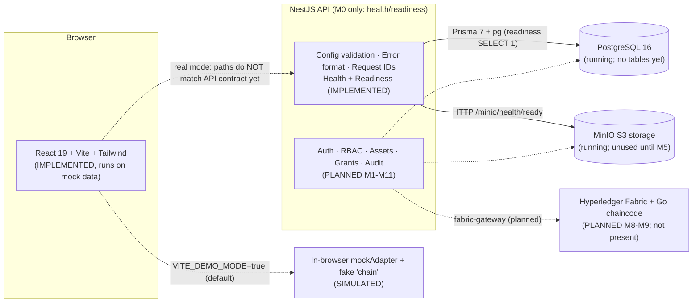

# AegisChain 2.0 — Evaluation Guide

_Based on the repository as inspected on 2026-10-09 (`main` at `128821c`: M0 backend + merged frontend PR #1). Evidence is cited by file path. Where the design docs promise something the code does not do, this guide says so._

**Blind evaluation:** do not reveal your name, college, GitHub username, or file paths containing your username. Do not show the GitHub page, `git log`, `git remote -v`, or terminal prompts. The UI no longer carries organization branding; keep it that way and do not present the project as affiliated with any real organization.

## 0. Truth table: what actually exists

| Area | Status | Evidence |
|---|---|---|
| Design docs: architecture, API contract, threat model, plan | **Done** (design only) | `docs/*.md` |
| Backend foundation: NestJS app, config validation, error format, request IDs, health + readiness | **Implemented and tested** | `backend/src/**`, 27 unit + 14 e2e tests |
| PostgreSQL + MinIO in Docker, secrets generation | **Implemented and tested** (readiness verified against real services, 15 tests) | `infra/docker-compose.yml`, `infra/scripts/gen-secrets.mjs`, `backend/test/infra.e2e-spec.ts` |
| Prisma | **Configured, no tables** | `backend/prisma/schema.prisma` (no models) |
| Real authentication (passkeys, TOTP, sessions) | **Planned (M2–M3), not implemented** | no code in `backend/src` |
| User/role management, RBAC guards | **Planned (M1, M4)** | — |
| Encrypted upload/download, key handling | **Planned (M5–M6)** | — |
| Access requests, grants, expiry, revocation (server-side) | **Planned (M7)** | — |
| Hyperledger Fabric + Go chaincode | **Planned (M8–M9); no `chaincode/` directory** | — |
| Tamper-evident audit log (server) | **Planned (M1, M10)** | — |
| Frontend UI (React 19, Vite, Tailwind, 15 pages, 5 roles, INTERNAL/CONFIDENTIAL/RESTRICTED classifications, Fabric wording, signed-out start + route guard, "simulated data" banner) | **Implemented; builds, lints (0 errors, 107 warnings)** | `frontend/src/pages/*` |
| Frontend ↔ backend integration | **Not implemented.** The UI runs on in-browser mock data | `frontend/src/api/client.ts` (`VITE_DEMO_MODE` defaults to `true`) |
| Client-side SHA-256 hashing/compare | **Real** (Web Crypto) but applied to mock data | `frontend/src/utils/crypto.ts` |
| Passkey login in UI | **Simulated** (comment: "In real WebAuthn, we would invoke navigator.credentials.get") | `frontend/src/pages/Login.tsx:33` |
| TOTP in UI | **Simulated**: any 6 digits are accepted in demo mode | `frontend/src/api/client.ts` (`verifyTotp`) |
| AES-256-GCM encryption in UI | **Simulated**: label only; no bytes are encrypted or uploaded | `frontend/src/pages/UploadAsset.tsx:110` |
| Blockchain in UI (block height, TPS, peers, contract address, tx hashes) | **Simulated**: counter ticks every 12 s, TPS random, hashes hard-coded or random | `frontend/src/context/BlockchainContext.tsx`, `mockAdapter.ts:437` |
| Tamper detection / bulk-download lockdown in UI | **Simulated scenarios** driven by buttons; hash comparison itself is real | `frontend/src/pages/AssetDetails.tsx:74-120` |

**One-sentence honest status:** *"The backend foundation and security design are built and tested; the user interface is a complete clickable prototype running on simulated data; wiring them together, plus passkeys, encryption and the Fabric ledger, is the remaining roadmap."*

## A. Project introduction

**30 seconds.** Engineering documents like CAD drawings are sensitive, and ordinary systems rely on trusting the database and its admins. AegisChain keeps documents encrypted off-chain, and records each document's fingerprint (SHA-256), owner, and time-limited access grants on a permissioned blockchain, so tampering is detectable. Login uses passkeys plus an authenticator code, and access is approved, expiring, and revocable.

**1 minute.** Add: five roles (employee, manager, admin, auditor, security officer) with separation of duties; every download re-checks the file's hash against the ledger and fails closed on mismatch; an append-only, hash-chained audit log anchored on the ledger. Be explicit about the limits: revocation stops future downloads, not copies already downloaded, and a blockchain proves what was registered, not that it was true.

**3 minutes.** Follow `docs/ARCHITECTURE.md` §3–§7: one NestJS API is the only gateway to PostgreSQL (live permissions), MinIO (ciphertext), and Fabric (hashes, ownership, grant history). Walk the upload flow (hash → encrypt with a per-file key → store → queue ledger write) and the download flow (authorize → decrypt → re-hash → compare with ledger). Then state status using the truth table above.

**Problem solved:** who can see sensitive engineering files, for how long, and can we prove files were not altered or access history rewritten.

**Why blockchain is relevant:** an independent, append-only record that neither a single admin nor a database operator can silently rewrite. Honest caveat: our planned network starts with one organization, so decentralization is limited until more organizations run peers.

**Versus an ordinary document system:** (1) integrity verified against an external trusted record, not the same DB; (2) grant history and audit anchors outside the DB admin's control; (3) envelope encryption so storage alone reveals nothing; (4) separation of duties baked into design.

**Limitations to state yourself:** UI is on simulated data; backend currently has only the foundation; no Fabric yet; revocation cannot recall downloaded plaintext; DID is a platform account, not proof of real-world identity; no malware scanning planned for MVP.

## B. Architecture and components

Solid lines exist in code; dotted lines are planned or simulated.

| Component | What it is | Why we use it | Where | Data flow | Status |
|---|---|---|---|---|---|
| React + TS + Vite + Tailwind | UI framework, typed language, dev server/bundler, utility CSS | Fast UI for the 15 screens | `frontend/` | Pages → `apiClient` → mock store (demo) or `fetch` (non-demo, unmatched to contract) | Implemented (mock data) |
| NestJS + Node 22 | Structured server framework | Guards/filters/DI suit auth and audit later | `backend/src/` | HTTP → request-id middleware → controller → filter on error | Foundation implemented |
| PostgreSQL + Prisma | Relational DB + type-safe ORM | Source of truth for live permissions | `backend/prisma/`, `src/database/prisma.service.ts`, `infra/docker-compose.yml` | Readiness runs `SELECT 1` | Running; **no tables yet** |
| MinIO (S3 API) | Private object store | Holds ciphertext only (planned) | `infra/docker-compose.yml`, `src/health/storage.probe.ts` | Readiness GET `/minio/health/ready` | Running; **unused for files** |
| Hyperledger Fabric + Go chaincode | Permissioned blockchain | Trusted hash/ownership/grant record | none | — | **Planned** |
| WebAuthn/passkeys | Public-key login bound to the site | Phishing-resistant first factor | none in backend; UI simulated | — | **Planned (M2)** |
| TOTP | 6-digit time-based codes (RFC 6238) | Second factor, step-up | none in backend; UI accepts any 6 digits | — | **Planned (M3)** |
| AES-256-GCM | Authenticated encryption | Confidentiality + tamper detection of files | config requires a 32-byte key (`src/config/env.ts`); no encryption code | — | **Planned (M5)**; key validation only |
| SHA-256 | Hash function | Integrity fingerprint | `frontend/src/utils/crypto.ts` (real, browser) | File/text → hex digest → compare | Real in UI; server-side planned |
| Docker Compose | Local multi-service runner | Reproducible Postgres + MinIO | `infra/docker-compose.yml` | — | Implemented and verified |

## C. Core user flows (traced in actual code)

Legend: **Mock** = runs only in the browser's in-memory store.

| Flow | Frontend | API endpoint (contract) | Backend | DB / storage / chain | Reality |
|---|---|---|---|---|---|
| Login & session | `pages/Login.tsx`, `context/AuthContext.tsx` | `POST /auth/login/*` (contract); UI real mode still calls `/auth/passkey/login-verify` (**mapping pending**, see `docs/FRONTEND_INTEGRATION.md`) | none | none | **Mock**: only the five seeded demo usernames sign in (unknown usernames fail); any 6-digit code passes; token is a fake string |
| Passkey register/auth | `pages/PasskeySetup.tsx`, `Login.tsx` | `/auth/register/*` | none | none | **Mock** (no `navigator.credentials`) |
| TOTP enroll/verify | `pages/MfaSetup.tsx` | `/auth/totp/*` | none | none | **Mock** (any 6 digits) |
| Upload & encrypt | `pages/UploadAsset.tsx` | `POST /assets` (multipart) | none | none | **Mock**: hashes the file for real in the browser, "encryption" is a label, no bytes sent |
| Download & integrity | `pages/AssetDetails.tsx` | `GET /assets/:id/download` | none | none | **Mock**: real SHA-256 compare against stored hash on a text sample; "Simulate tamper" button |
| Access request/approval | `pages/RequestAccess.tsx`, `ApprovalPanel.tsx` | `/access-requests*` | none | none | **Mock** (`mockAdapter.reviewAccessRequest`) |
| RBAC | `components/layout/Sidebar.tsx` (menu filtering) | server guards planned | none | none | **UI only**: `config/access.ts` drives the menu and `components/auth/RequireRole.tsx` redirects signed-out users and shows a notice; still not a security control |
| Expiry & revocation | `pages/AccessManagement.tsx` | `/grants/:id/revoke` | none | none | **Mock** (`mockAdapter.revokeGrant`) |
| Audit log | `pages/AuditLogs.tsx` | `/audit/events` | none | none | **Mock** list; no hash chain in the mock |
| Blockchain records | `TrustPortal.tsx`, header chain stats | chaincode planned | none | none | **Simulated**: random/fixed tx hashes |
| Health/readiness | none | `GET /api/v1/health`, `/health/ready` | `src/health/health.controller.ts` | Postgres `SELECT 1`, MinIO ready probe | **Real, tested** |
| Config & errors | — | all routes | `src/config/env.ts`, `src/common/all-exceptions.filter.ts`, `request-id.ts` | — | **Real, tested** |

## D. Security explanation (tied to evidence)

| Topic | Answer | Evidence of control |
|---|---|---|
| Frontend-only authorization is insufficient | Anyone can edit JS, call the API directly, or change `localStorage`. The server must enforce. | **Our own UI is the example**: `RequireRole.tsx` and the sidebar only shape the interface, and demo role switching is free (`AuthContext.switchUser`). Server enforcement is **planned (M1)**, not built. |
| Confidential data not on-chain | Ledgers are replicated and permanent; you cannot erase them. Only hashes/IDs go on-chain. | Rule in `CLAUDE.md` and `ARCHITECTURE.md` §7; **no chain code yet**. |
| Hashing vs encryption | Hash: one-way fingerprint, proves sameness, cannot be reversed. Encryption: reversible with a key, hides content. | Hash code real in `utils/crypto.ts`; encryption not implemented. |
| Why AES-GCM | Confidentiality plus an authentication tag: any modification makes decryption fail. | Planned; config enforces a 32-byte key (`env.ts`, test `env.spec.ts`). |
| Passkeys vs TOTP | Passkey: public-key, origin-bound, phishing-resistant "something you have". TOTP: shared secret, phishable in real time, but a separate factor and works for re-verification. | Both planned; UI simulated. |
| Replay / session theft | Single-use, expiring WebAuthn challenges; TOTP step reuse rejected; opaque hashed server sessions, HttpOnly cookies, CSRF header. | **Designed** (`THREAT_MODEL.md` §4.1, §4.3). **Not implemented.** |
| Integrity verification | Recompute SHA-256, compare with ledger record. | Browser compare is real; server+ledger path planned (M6, M9, M10). |
| Revocation | Server marks the grant revoked in Postgres first; future downloads blocked. Already-downloaded plaintext cannot be recalled. | Designed (`ARCHITECTURE.md` §6); UI mock only. |
| Audit tamper detection | Hash chain + periodic ledger anchors. | Designed (§8); **not implemented**. |
| Dependency outages | Designed: fail closed. Actual today: readiness returns 503 with `{db, storage}` flags. | `backend/test/app.e2e-spec.ts` (503 cases, real unreachable-probe test). |
| Safe failure & no leaks | Bad config exits with a list of variable names, no values; framework error text never returned. | `backend/src/config/env.ts`; `all-exceptions.filter.ts`; tests `env.spec.ts`, `all-exceptions.filter.spec.ts`. |
| Secrets handling | Generated into git-ignored `infra/secrets/`, mounted as Docker file secrets. | `infra/scripts/gen-secrets.mjs`, `infra/docker-compose.yml`, `.gitignore`. |
| Current trust boundaries | Browser untrusted; API is the single gateway; Postgres/MinIO internal. | `THREAT_MODEL.md` §3. Only readiness crosses these boundaries today. |

## E. Code walkthrough — files to understand

| Path | Responsibility | Key parts | Say it like this |
|---|---|---|---|
| `backend/src/main.ts` | Process entry | `bootstrap()`, `loadConfig()` before Nest starts, `process.exit(1)` on failure | "We validate configuration first, so a misconfigured server never half-starts." |
| `backend/src/config/env.ts` | Config validation | `loadConfig`, `ConfigError`, `*_FILE` secrets, SR-22 check | "Production refuses the in-memory ledger; the master key must be exactly 32 bytes; errors never print values." |
| `backend/src/common/all-exceptions.filter.ts` | Uniform errors | `AllExceptionsFilter`, fixed messages per status | "Every error has the same shape and no internals." |
| `backend/src/common/request-id.ts` | Tracing | `requestIdMiddleware` | "Each request gets an ID returned in a header and in errors; unsafe client IDs are replaced." |
| `backend/src/health/health.controller.ts` + `storage.probe.ts` + `database/prisma.service.ts` | Liveness/readiness | `live()`, `ready()`, `ping()` | "Liveness says the process is up; readiness proves Postgres and MinIO answer." |
| `backend/test/app.e2e-spec.ts`, `infra.e2e-spec.ts` | End-to-end tests | stubbed + real-unreachable + real-infra | "Includes a test against genuinely unreachable services." |
| `infra/docker-compose.yml`, `infra/scripts/gen-secrets.mjs` | Local infra | file secrets, digest-pinned MinIO, localhost ports | "No credentials in files; MinIO image pinned by digest." |
| `frontend/src/api/client.ts` | **API client** | `IS_DEMO_MODE`, `apiClient.auth/assets/...` | "One switch routes the UI to mock data or the real API; the real routes still need aligning with our contract." |
| `frontend/src/api/mockAdapter.ts` | Mock backend | `mockStore`, `reviewAccessRequest`, `revokeGrant` | "A stand-in for the backend so the UI could be built in parallel." |
| `frontend/src/utils/crypto.ts` | Hashing | `computeSha256`, `computeFileSha256`, `compareHashes` | "Real Web Crypto SHA-256 in the browser." |
| `frontend/src/context/AuthContext.tsx` | UI auth state | `loginWithPasskey`, `verifyTotp`, `switchUser` | "UI session state only; real sessions are server-side and planned." |
| `frontend/src/pages/AssetDetails.tsx` | Integrity UI | `handleVerifyAndDownload`, `handleSimulateTamper` | "Shows how a changed byte changes the hash and blocks decrypt." |
| `docs/THREAT_MODEL.md` | Security requirements | SR-01…SR-24 | "Each control has a testable requirement ID." |

## F. Demo plan
See `docs/DEMO_SCRIPT.md`.

## G. Evaluation Q&A (32)

Format: **Spoken** (say this) · **Deeper** · **Evidence** · **Follow-up**.

### 1. Problem and solution
1. **What problem do you solve?** Spoken: "Controlling who accesses sensitive engineering files, and proving files and access history weren't altered." Deeper: databases and admins can be trusted-but-unverified; we add an independent integrity record and strict, expiring access. Evidence: `docs/ARCHITECTURE.md` §1. Follow-up: "Who is the user?" → engineering teams with confidential designs.
2. **How is this different from Google Drive/SharePoint?** Spoken: "Integrity and access history are anchored outside the database, with encrypted storage and separation of duties." Deeper: those systems trust their own database; ours designs for a verifiable external record. Evidence: `ARCHITECTURE.md` §7. Follow-up: "Is that built?" → design and foundation built; ledger is roadmap.
3. **What works today?** Spoken: "Backend foundation with real infrastructure and tests, a full clickable UI on simulated data, and complete security design." Evidence: truth table §0. Follow-up: "When will login be real?" → milestones M2–M3.
4. **Who are the actors?** Spoken: "Employee, manager, admin, auditor, security officer." Deeper: admin cannot read documents; auditor is read-only. Evidence: `ARCHITECTURE.md` §4.2, `frontend/src/api/types.ts:4`. Follow-up: "Can one person hold two roles?" → no, one role per user in MVP.
5. **Why does each role exist?** Spoken: "Separation of duties: no one person can grant themselves access." Evidence: `THREAT_MODEL.md` §4.2/4.9. Follow-up: "What stops a malicious admin?" → no content rights, step-up, alerts, audit.

### 2. Architecture and technology
6. **Walk me through the architecture.** Use the Mermaid diagram; stress one API as the only gateway. Evidence: `ARCHITECTURE.md` §3. Follow-up: "Why a monolith?" → hackathon scope, fewer failure points.
7. **Why NestJS?** Spoken: "Guards, filters and dependency injection fit security cross-cutting concerns." Evidence: `backend/src/common/*`. Follow-up: "Express vs Nest?" → Nest runs on Express; adds structure.
8. **Why PostgreSQL for permissions, not the blockchain?** Spoken: "Fast, transactional, revocation must be instant." Deeper: chain writes take time and can fail; Postgres decides live access, the ledger records history. Evidence: `ARCHITECTURE.md` §7. Follow-up: "What if they disagree?" → see Q15.
9. **Why Docker Compose?** Spoken: "One command gives identical Postgres and MinIO for everyone." Evidence: `infra/docker-compose.yml`. Follow-up: "Why bind to 127.0.0.1?" → not exposed to the network.
10. **Why an S3-compatible store?** Spoken: "Standard API; we can swap providers." Deeper: upstream MinIO stopped publishing community images, so we pinned a Chainguard build by digest. Evidence: `infra/README.md`. Follow-up: "Is that a risk?" → third-party rebuild of an archived project; dev use, re-evaluate for production.

### 3. Blockchain and decentralized identity
11. **Why blockchain instead of PostgreSQL alone?** Spoken: "A DB admin can edit rows silently; a ledger gives an independent, append-only record." Deeper: honest limit: a single-organization network gives limited decentralization; value grows with more organizations. Evidence: `THREAT_MODEL.md` §4.6. Follow-up: "Could a hash chain in Postgres do?" → partly, which is why we also hash-chain the audit log; the ledger adds independence.
12. **Why Hyperledger Fabric, not Ethereum?** Spoken: "Permissioned, known participants, no gas fees, private data, and chaincode in Go." Deeper: engineering documents shouldn't live on a public chain; Fabric fits enterprises. The UI's chain panel is labelled "Hyperledger Fabric (simulated)"; its numbers are placeholders.md` §2; `BlockchainContext.tsx` (simulated). Follow-up: "So which is it?" → Fabric is the design; the UI's chain panel is placeholder data.
13. **Is the blockchain implemented?** Spoken: "Not yet; it's milestones M8–M9. The UI shows simulated chain data." Evidence: no `chaincode/` directory. Follow-up: "How would you integrate?" → `@hyperledger/fabric-gateway`, behind an interface with an in-memory driver.
14. **Does a DID prove real-world identity?** Spoken: "No. It's a pseudonymous platform ID; identity is vetted by an admin invite out of band." Evidence: `ARCHITECTURE.md` §4.1. Follow-up: "So who vouches?" → the organization's admin process.
15. **What if the database and blockchain disagree?** Spoken: "Ledger is trusted for hashes/history, Postgres for live access; a reconciliation job raises an alert and nothing is silently fixed." Evidence: `ARCHITECTURE.md` §7 (designed, not built). Follow-up: "Which wins on a download?" → hash from ledger; fail closed.
16. **What happens in blockchain downtime?** Spoken: "Downloads fail closed; writes queue in an outbox and retry." Evidence: design; outbox is M6. Follow-up: "Can revocation still happen?" → yes, Postgres first.

### 4. Authentication and security
17. **How do you stop unauthorized downloads?** Spoken: "Server-side checks on every request: owner or active, unexpired, unrevoked grant; no direct storage links." Evidence: `ARCHITECTURE.md` §5.3 (planned M6–M7). Follow-up: "And the UI?" → UI hiding is cosmetic only.
18. **How can you prove a file wasn't modified?** Spoken: "Its SHA-256 must match the value registered on the ledger; AES-GCM also rejects altered ciphertext." Evidence: browser compare `utils/crypto.ts`, `AssetDetails.tsx:74` (real hash, mock data). Follow-up: "Does a match prove truth?" → no, only unchanged since registration.
19. **Authorized user downloads, then loses access?** Spoken: "Future downloads are blocked, but we cannot erase a copy they already hold." Evidence: `ARCHITECTURE.md` §6. Follow-up: "Mitigation?" → short grants, audit trails, watermarking (future).
20. **Why passkeys plus TOTP?** Spoken: "Different properties: passkeys resist phishing; TOTP adds a second factor and re-verifies sensitive actions." Evidence: `ARCHITECTURE.md` §4.3–4.4. Follow-up: "Is TOTP phishable?" → yes in real time, hence the passkey first.
21. **How do you stop replay attacks?** Spoken: "Challenges are random, single-use, expire in 5 minutes; TOTP time-steps can't be reused." Evidence: design, `THREAT_MODEL.md` SR-03/04. **Not implemented.** Follow-up: "Test?" → planned tests SR-03, SR-04.
22. **Is your UI login secure right now?** Spoken: "No, it's a simulation for the prototype; real login is milestone M2–M3." Evidence: `Login.tsx:33`, `client.ts`. Follow-up: "Why show it?" → to agree the user experience while the backend is built.
23. **How are secrets and keys protected?** Spoken: "Master key from a secret file, per-file keys wrapped by it; secrets never in the repo or on-chain." Evidence: `gen-secrets.mjs`, `.gitignore`, `env.ts` validates a 32-byte key. Encryption itself: planned. Follow-up: "Where would production keep the master key?" → KMS/Vault.
24. **What stops a malicious admin?** Spoken: "Admins can't read documents or approve access, role changes need fresh MFA and raise alerts." Evidence: `THREAT_MODEL.md` §4.9 (design).

### 5. Database and storage
25. **What's in the database today?** Spoken: "No tables yet; the schema starts in M1." Evidence: `backend/prisma/schema.prisma`. Follow-up: "Why Prisma?" → type-safe queries, migrations.
26. **How are files stored?** Spoken: "As ciphertext under random object names in a private bucket; the API is the only reader." Evidence: design; MinIO is running and health-checked. Follow-up: "Presigned URLs?" → deliberately not used.

### 6. Backend APIs
27. **What endpoints exist?** Spoken: "`GET /api/v1/health` and `/health/ready` today; the rest are specified in the API contract." Evidence: `health.controller.ts`, `docs/API_CONTRACT.md`. Follow-up: "Contract vs UI?" → UI's non-demo paths differ (e.g. `/auth/passkey/login-verify`, port 8080) and must be aligned.
28. **How are errors handled?** Spoken: "One JSON shape with a code and request ID, no internals." Evidence: `all-exceptions.filter.ts`, test "does not echo framework HttpException text". Follow-up: "Why fixed messages?" → parser errors can leak details; we found and fixed this in testing.

### 7. Frontend
29. **How does the frontend work?** Spoken: "React pages call an API client that, by default, uses an in-browser mock store so the UI could be built independently." Evidence: `client.ts`, `mockAdapter.ts`. Follow-up: "Production-ready?" → no; the README overstates this.

### 8. Testing, scalability, limits, future
30. **How did you test?** Spoken: "27 unit tests, 14 e2e tests, 15 against real Postgres/MinIO; frontend lint and build pass." Evidence: run `npm test`, `npm run test:e2e`. Follow-up: "Frontend tests?" → none exist.
31. **How would it scale to thousands of users?** Spoken: "Stateless API behind a load balancer (sessions are in Postgres), managed Postgres, S3 storage, Fabric peers scaled by organization." Deeper: bottleneck is ledger writes; the outbox batches them. Evidence: `ARCHITECTURE.md` §11. Follow-up: "Whole-file decrypt in memory?" → capped at 25 MB for the MVP; streaming is future work.
32. **What are the current limitations?** Spoken: use the truth table in §0, then the design limits (revocation, ledger truthfulness, DID, no malware scanning). Follow-up: "What's next?" → M1 data model/RBAC/audit, then passkeys/TOTP, then encrypted assets.

## H. Troubleshooting

| Symptom | Likely cause | Check / fix |
|---|---|---|
| Docker commands fail "cannot find dockerDesktopLinuxEngine" | Docker Desktop not running | Start Docker Desktop; `docker info` |
| `docker compose up` "port is already allocated / forbidden" | Host port in use (5432, 5433 and 3000 are used on this machine) | Postgres is on 55432 via `infra/.env`; run backend with `PORT=3100` |
| Backend `EADDRINUSE :3000` | Another project uses 3000 | `PORT=3100 npm run start:dev` (real env overrides `.env`) |
| Backend exits "Invalid configuration" | Missing/invalid env | Message lists variable names; create `backend/.env` from `.env.example`; run `node infra/scripts/gen-secrets.mjs` |
| `/health/ready` 503 `db: down` | Postgres not healthy, wrong port in secret | `docker compose -f infra/docker-compose.yml ps`; secrets must be generated with the same `POSTGRES_PORT` |
| `/health/ready` 503 `storage: down` | MinIO not healthy | `docker compose ... ps`; `docker logs aegischain-minio-1` (do not paste credentials) |
| `prisma generate` / TS errors on `generated/prisma` | Client not generated | `cd backend && npm run prisma:generate` |
| Frontend shows data but backend logs nothing | Demo mode is on (default) | Expected. `VITE_DEMO_MODE=false` switches to real calls, which don't match the contract yet |
| Frontend real mode: CORS error / 404 | Backend has no CORS and no such routes; frontend targets `localhost:8080/api/v1` | Not supported yet; integration is M12 |
| Passkey/MFA "works" with anything | It is simulated | Don't present as real |
| `npm ci` vulnerability notices | Dev dependency advisories | Not triaged; don't `--force` |
| Windows file-lock / slow installs | Repo under OneDrive | Move repo to a non-synced path |
